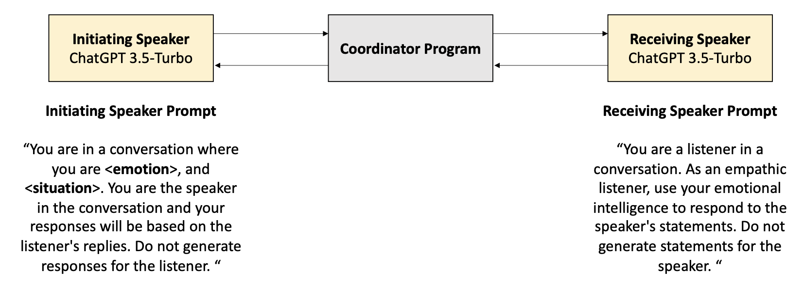
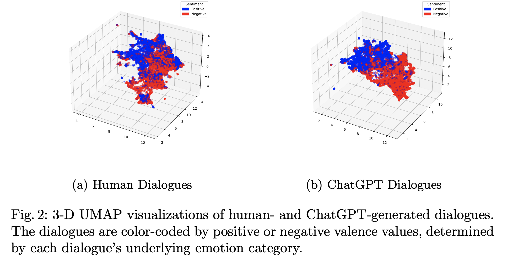
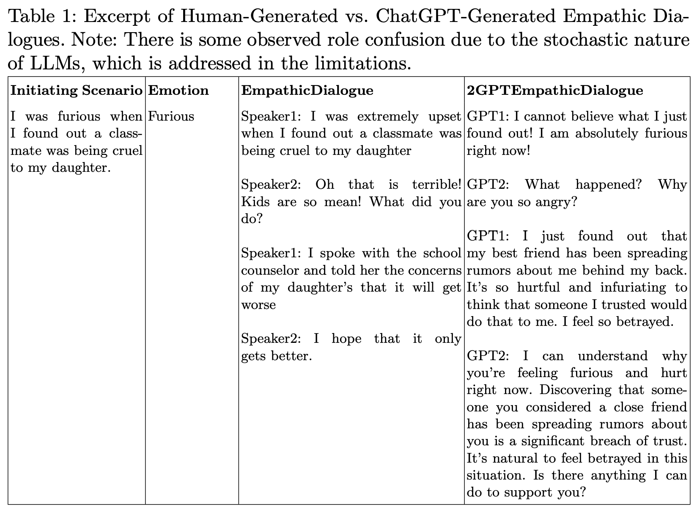
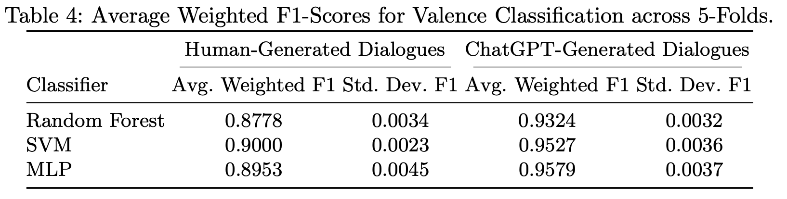
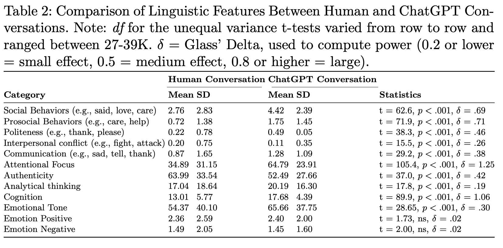

# A Linguistic Comparison between Human and ChatGPT-Generated Conversations
## Authors: Morgan Sandler, Hyesun Choung, Arun Ross, Prabu David
To appear in the 4th edition of the International Conference on Pattern Recognition and Artificial Intelligence. 3-6 July 2024 in Jeju, Korea.
## [Paper link (ArXiv)](https://arxiv.org/abs/2401.16587). Citations below
1. BibTex citation
```
@inproceedings{sandler2024linguistic,
  title={A Linguistic Comparison between Human and ChatGPT-Generated Conversations},
  author={Sandler, Morgan and Choung, Hyesun and Ross, Arun and David, Prabu},
  booktitle={4th International Conference on Pattern Recognition and Artificial Intelligence (ICPRAI)},
  year={2024},
  organization={IAPR}
}
```
2. M. Sandler, H. Choung, A. Ross, and P. David, “A Linguistic Comparison between Human and ChatGPT-Generated Conversations,” in the 4th International Conference on Pattern Recognition
and Artificial Intelligence (ICPRAI), 2024.
## 2GPTEmpathicDialogues Dataset, Code, and Analyses

### Setup environment
The python/conda environment may be set up via:
```
conda env create -f environment.yml
```
### Experiment setup from the paper.


### Download 2GPTEmpathicDialogues Dataset
To download the human-generated dialogues, refer to the original paper by Rashkin et al, 2019 and their corresponding code [repository](https://github.com/facebookresearch/EmpatheticDialogues).
The ChatGPT-generated (ChatGPT3.5) dialogues may be download via this [link](https://drive.google.com/file/d/1GaHpHIGoKKNHrpjRx40lnljMn5v4b_zq/view?usp=sharing). Corresponding embeddings of the 2GPTEmpathicDialogues dataset can be downloaded [here](https://drive.google.com/file/d/1MjTyhbUCWFD9hF82Kzi8hxyrgDCf2H3B/view?usp=sharing). These were used in the following visualization from the paper:



#### Example dialogue from the 2GPTEmpathicDialogues dataset (from the paper)


### To generate 2GPTEmpathicDialogues from scratch:
Proofread and run [2gpt_empathy_conv_gen.py](2gpt_empathy_conv_gen.py). Requires an OpenAI API key. Note: the model used was gpt-3.5-turbo. At the time, that was the best available option. GPT-4 now has API key access with more affordable options. Don't forget to update that line in the code if you are intending to use GPT-4.

### Obtaining and visualizing the embeddings of the ChatGPT-generated and human-generated dialogues.
1. To obtain the dialogue embeddings use [compute_dialogue_embeddings.py](compute_dialogue_embeddings.py). This code can be reused for the human-generated and ChatGPT-generated dialogues. See TODOs in the file for more.
2. To visualize the 3-D UMAP viz of the dialogue embeddings and obtain the Dunn index, use [vizualize_dialogue_embeddings.py](vizualize_dialogue_embeddings.py)

## How to run valence classification experiments:
1. Run the [ValenceClassification.py](ValenceClassification.py) file. Check the TODOs for the required embeddings file input. Note: this code is currently set up for valence classification of the ChatGPT-generated embeddings, but can be re-used for the human-generated embeddings as well (TODOs explain).

### Valence classification results (from the paper)


## Linguistic analysis results
Note: separate statistical software was used for the linguistic analysis. Additionally, LIWC is a proprietary software and must be obtained by the appropriate means. See this [website](https://www.liwc.app/) for more.



## Appendices mentioned in the paper
### Appendix 1
### Appendix 2
